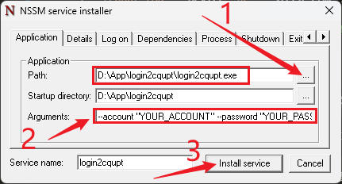

# cqupt

Auto-login toy for CQUPT.

## 环境准备（注意 `Powershell` 必须安装！）

-   `Python > 3.0`

```bash
conda create -n test python=3.8
conda activate test
pip install -r requirements.txt
```

-   `PowerShell` 安装（依赖于这个命令行软件）

> 官方文档：https://learn.microsoft.com/zh-cn/powershell/scripting/install/installing-powershell-on-windows?view=powershell-7.3#install-powershell-using-winget-recommended

```powershell
winget search Microsoft.PowerShell
winget install --id Microsoft.Powershell --source winget
```

## `WIN` 打包并安装为服务程序

> 打包为 `.exe` 可执行文件，

```bash
pyinstaller.exe --uac-admin --onefile login2cqupt.py
```

> 作为服务程序进行安装

1. 将生成的 dist/login2cqupt 复制到你的 `APP` 目录下；

2. 下载配置 `nssm` 工具（[下载地址](https://nssm.cc/download)；`nssm` 下载安装好之后，将 `x64/nssm.exe` 的完整路径添加到 系统环境变量的 `PATH` 条目下，

    

3. 使用 `nssm` 工具将可执行程序 `login2cqupt.exe` 安装为服务程序，使得可以在后台运行，以及开启自启动；

以管理员身份运行 `CMD/PowerShell`，执行以下命令，

```bash
nssm install login2cqupt  # 安装 login2cqupt 服务程序
# 找到 `APP/login2cqupt/login2cqupt.exe`，并添加以下参数
--account "YOUR_ACCOUNT" --password "YOUR_PASSWD" --operator "移动" --log_path "./cqupt.log" --device "pc" --sleep_time 30

nssm start login2cqupt  # 启动 login2cqupt 服务程序
```

如图示，


打开 `Windows` 服务，可以看到安装的 `login2cqupt` 的运行状况，也可以在 任务管理器 —— 服务 中进行查看。

## ⚡ 注意

> WiFi 的话要首先连接（自动创建连接配置文件），分配给指定接口的配置文件“CQUPT”

```
%ProgramData%\Microsoft\Wlansvc\Profiles\Interfaces\网卡ID
```

网卡 ID 可通过 [TMAC](https://technitium.com/tmac/) 查看，还可以通过 `TMAC` 更改适配器的 `MAC` 地址，突破网速的限制（可能不太稳定，延迟时高时低）。

> 如果蓝屏，到官方网站手动下载安装最新的网络驱动器！
